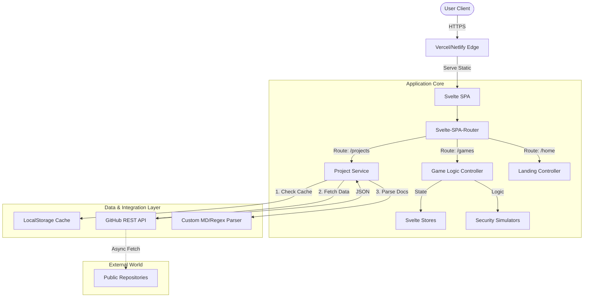

# Klea Dev Portfolio

> **A high-performance, interactive developer portfolio demonstrating full-stack engineering, security mindset, and creative design.**

<div align="center">


</div>

---

## Overview

**klea-dev** is not just a digital resume; it is a **Technical Proof of Concept**. It replaces the traditional static portfolio with an immersive, gamified Single Page Application (SPA) that actively demonstrates the skills it claims to possess.

From **exploiting simulated SQL vulnerabilities** to **reverse-engineering CSS layouts**, every interaction is designed to showcase engineering depth. Under the hood, it leverages a modern **Svelte 5 + Vite** architecture for sub-second load times and seamless interactivity, backed by a robust GitHub integration layer that keeps content dynamically synchronized with real-world activity.

## Key Features

### Security & Engineering Playground

The core of the portfolio is a suite of interactive "games" that serve as technical demos:

| Game Module | Technical Domain | Learning Outcome |
|:-----------|:----------------|:-----------------|
| **SQL Injection** | **Backend Security** | Demonstrates vulnerability exploit chains (Union-based, Boolean-blind) and the importance of parameterized queries. |
| **Password Cracker** | **Algorithms / Perf** | Visualizes brute-force complexity and dictionary attacks, teaching entropy concepts and JS performance optimization. |
| **Button Stopper** | **Event Loop / DOM** | A test of reflexes that actually tests understanding of the JavaScript event loop, microtasks, and DOM manipulation speed. |
| **CSS Artist** | **Frontend Design** | A "reverse engineering" challenge requiring pixel-perfect replication of designs using raw CSS properties. |
| **Code Debugger** | **Software Quality** | Real-world bug hunting scenarios analyzing scope, async/await race conditions, and logical refactoring. |

### Live GitHub Integration

Instead of manual updates, the portfolio acts as a live dashboard:

- **Real-time Data**: Fetches repository stats (stars, forks, languages) directly from the GitHub API.
- **Smart Caching**: Implements an LRU-style local storage caching layer to optimize API usage and respect rate limits.
- **Meta-Templating**: Projects can include a `TEMPLATE.md` in *their* repo, which this portfolio automatically parses and renders as a rich project detail page.

### Performance & Accessibility

- **99+ Lighthouse Score**: Optimized asset loading, code splitting, and tree-shaking via Vite.
- **A11y First**: Built-in High Contrast Mode and generic `prefers-reduced-motion` support.
- **Keyboard Navigation**: Full tab index management and semantic HTML structure.

## System Architecture

The application follows a modular, service-oriented frontend architecture.


```mermaid
graph TD
    User([User Client]) -->|HTTPS| CDN[Vercel/Netlify Edge]
    CDN -->|Serve Static| SPA[Svelte SPA]

    subgraph "Application Core"
        SPA --> Router[Svelte-SPA-Router]
        
        Router -->|Route: /games| GameEngine[Game Logic Controller]
        Router -->|Route: /projects| ProjectService[Project Service]
        Router -->|Route: /home| HomeView[Landing Controller]

        GameEngine -->|State| Stores[Svelte Stores]
        GameEngine -->|Logic| SecSim[Security Simulators]
    end

    subgraph "Data & Integration Layer"
        ProjectService -->|1. Check Cache| Cache[LocalStorage Cache]
        ProjectService -->|2. Fetch Data| GitHubAPI[GitHub REST API]
        ProjectService -->|3. Parse Docs| MarkdownParser[Custom MD/Regex Parser]
        
        GitHubAPI -->|JSON| ProjectService
    end

    subgraph "External World"
        GitHubAPI -.->|Async Fetch| RemoteRepos[Public Repositories]
    end
```

## Project Structure

The codebase is organized to separate concerns between presentation, logic, and data.

```
klea-dev/
├── src/
│   ├── assets/                 # ✅ SVG icons, images, and static resources
│   │   └── svelte.svg
│   ├── lib/
│   │   ├── components/         # 🧱 Reusable UI bricks
│   │   │   ├── games/          #    - Game-specific logic components
│   │   │   ├── Navigation.svelte
│   │   │   └── ThemeToggle.svelte
│   │   ├── data/               # 💾 Static configuration & fallback data
│   │   │   ├── projects.js     #    - Fallback project list
│   │   │   └── research.js     #    - Research publications
│   │   ├── pages/              # 📄 High-level Route Views
│   │   │   ├── Home.svelte
│   │   │   └── projects/       #    - Dynamic Project Details
│   │   ├── services/           # 🔌 External Integrations
│   │   │   ├── github.ts       #    - API Wrapper & Rate Limiting
│   │   │   └── readmeParser.ts #    - Markdown -> HTML converter
│   │   └── utils/              # 🛠 Helper functions (formatting, validation)
│   ├── App.svelte              # 🌳 Root Component (Global State/Layout)
│   ├── main.ts                 # 🚀 Entry Point (Mounts App)
│   └── routes.js               # 🚦 Route Definitions
├── public/                     # 🌍 Public deliverables (manifest, robots.txt)
├── package.json                # 📦 Dependency manifest
└── vite.config.ts              # ⚡ Build configuration (plugins, aliases)
```

## Tech Stack

| Domain | Technology | Rationale |
|:-------|:-----------|:----------|
| **Framework** | **Svelte 5** | compiled-away framework for minimal runtime overhead and maximum reactivity. |
| **Bundler** | **Vite** | Instant HMR (Hot Module Replacement) and optimized Rollup-based production builds. |
| **Language** | **TypeScript** | Strict type safety for data structures, API responses, and component props. |
| **Styling** | **Tailwind CSS** | Utility-first styling for rapid UI development and consistent design system tokens. |
| **Routing** | **svelte-spa-router** | Lightweight hash-based routing perfect for static hosting environments. |
| **Icons** | **Lucide Svelte** | Modern, consistent, treeshakable SVG icon library. |
| **Motion** | **svelte-motion** | Port of Framer Motion for complex, spring-based animations. |

## Getting Started

Follow these instructions to set up the environment locally.

### Prerequisites

- **Node.js** v18.0.0 or higher
- **npm** v9.0.0 or higher
- A **GitHub Personal Access Token** (optional, for higher API limits)

### Installation

1. **Clone the Repository**

    ```bash
    git clone https://github.com/KleaSCM/klea-dev.git
    cd klea-dev
    ```

2. **Install Dependencies**

    ```bash
    npm install
    # or pnpm install / yarn install
    ```

3. **Configure Environment**
    Create a `.env` file in the root directory. *Note: The file is git-ignored for security.*

    ```ini
    # Optional: Increases GitHub API rate limit from 60 to 5000 requests/hr
    VITE_GITHUB_TOKEN=your_github_pat_token_here
    ```

4. **Run Development Server**

    ```bash
    npm run dev
    ```

    Open `http://localhost:5173` in your browser.

### Build for Production

To create an optimized production build:

```bash
npm run build
```

This generates a `dist` folder containing static HTML, CSS, and JS files ready for deployment.

### Linting & Formatting

Ensure code quality before committing:

```bash
# Run Svelte and TypeScript checks
npm run check

# Preview the production build locally
npm run preview
```

---
