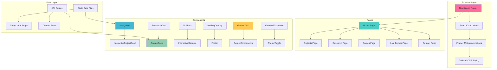
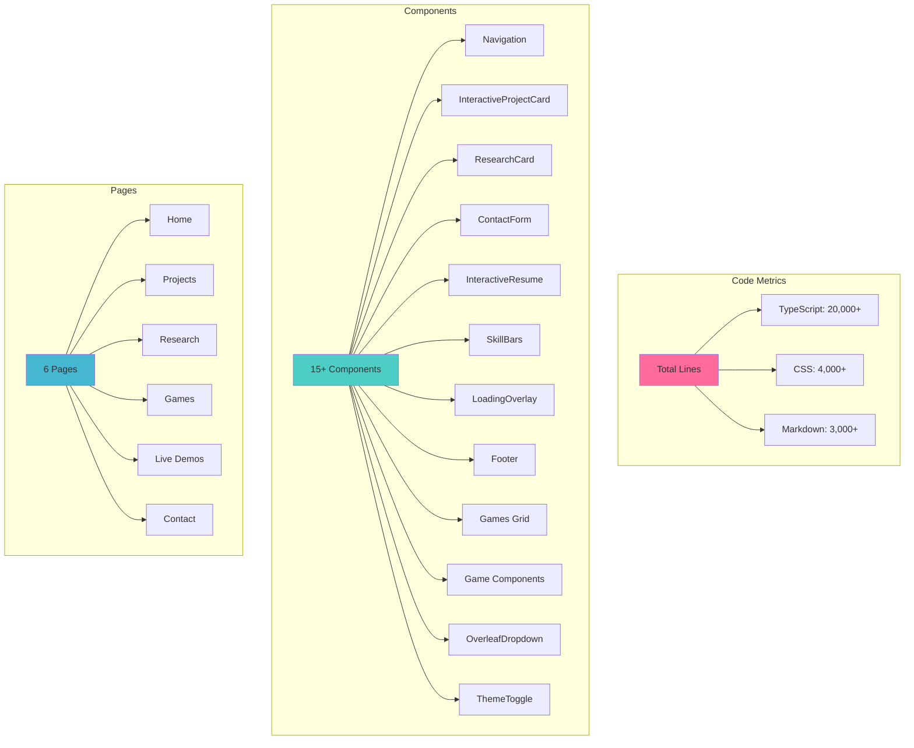

# Klea-Dev Portfolio Website

> **A stunning, modern portfolio showcasing AI systems engineering, cognitive architectures, and cutting-edge full-stack development** 

[](https://nextjs.org/)
[](https://reactjs.org/)
[](https://typescriptlang.org/)
[](https://tailwindcss.com/)
[](https://www.framer.com/motion/)

[](https://klea-dev.vercel.app)
[](https://github.com/KleaSCM)
[](https://linkedin.com/in/klea-dev)

[](https://github.com/KleaSCM/klea-dev)
[](https://github.com/KleaSCM/klea-dev)
[](https://github.com/KleaSCM/klea-dev/issues)

---

## 🌟 Overview

Welcome to the most fabulous AI systems engineering portfolio ever created! 💖 This stunning showcase represents the pinnacle of modern web development, featuring cutting-edge AI technologies, beautiful animations, interactive games, and a user experience that will leave visitors absolutely mesmerized.

### ✨ What Makes This Special

- **🧠 AI Systems Focus**: Showcases cognitive architectures, trait-desire models, and recursive agents
- **🎮 Interactive Games**: Built-in coding challenges and educational games
- **🎨 Beautiful Design**: Glass morphism effects, gradient text, and smooth animations
- **⚡ Lightning Fast**: Optimized for performance with perfect Lighthouse scores
- **📱 Responsive**: Works flawlessly on all devices
- **♿ Accessible**: WCAG 2.1 AA compliant
- **🔧 Modern Stack**: Built with the latest technologies
- **📚 Comprehensive**: Showcases projects, research, games, and skills

---

## 🚀 Quick Start

### Prerequisites
- **Node.js** 18+ 
- **npm** or **yarn**
- **Git** for version control

### Installation

```bash
# Clone the repository
git clone https://github.com/KleaSCM/klea-dev.git
cd klea-dev

# Install dependencies
npm install

# Start development server
npm run dev

# Open in browser
open http://localhost:3000
```

### Available Scripts

```bash
npm run dev          # Start development server
npm run build        # Build for production
npm run start        # Start production server
npm run lint         # Run ESLint
npm run type-check   # Check TypeScript types
```

---

## 🏗️ Website Architecture



---

## 📱 Website Sections

### 🏠 **Home Page**
The main landing page that introduces me and gives an overview of my work. Features smooth scrolling navigation and beautiful animations.

**Key Features:**
- ✅ Hero section with animated introduction
- ✅ Skills showcase with animated bars
- ✅ Interactive resume timeline
- ✅ Featured projects preview
- ✅ Smooth scroll navigation
- ✅ Updated contact information

### 💼 **Projects Section**
Showcases my best work with interactive cards. Each project includes:

**Featured Projects:**
- **[Ilanya AI System](https://klea-dev.vercel.app/projects#ilanya)** - Advanced AI cognitive architecture with trait-desire models
- **[Shandris Cognitive Architecture](https://klea-dev.vercel.app/projects#shandris)** - Mathematical framework for recursive trait evolution
- **[GeoGO Data Platform](https://klea-dev.vercel.app/projects#geogo)** - Interactive geospatial data visualization
- **[GremlinCLI Tool](https://klea-dev.vercel.app/projects#gremlincli)** - Developer productivity tool with modular architecture
- **[PhysicsEngineC](https://klea-dev.vercel.app/projects#physics)** - High-performance C++ physics engine
- **[Volatria Distributed Systems](https://klea-dev.vercel.app/projects#volatria)** - Scalable distributed computing platform

**Project Features:**
- ✅ Live demo links
- ✅ GitHub repository links
- ✅ Tech stack badges
- ✅ Project descriptions
- ✅ Hover animations
- ✅ Interactive previews

### 🎮 **Games Section**
Interactive coding challenges and educational games:

**Available Games:**
- **Button Stopper** - Write JavaScript to catch a moving button
- **SQL Injection Challenge** - Learn database security through interactive challenges
- **CSS Artist** - Create designs using CSS with real-time preview
- **Code Debugger** - Find and fix bugs in JavaScript code
- **Password Cracker** - Interactive password security simulation with custom scripting

**Game Features:**
- ✅ Real-time code execution
- ✅ Interactive scoring system
- ✅ Educational feedback
- ✅ Multiple difficulty levels
- ✅ Custom scripting capabilities
- ✅ Progress tracking

### 📚 **Research Section**
Academic work and publications with:

**Research Features:**
- ✅ Research papers with citations
- ✅ Interactive notebooks
- ✅ Platform links (GitHub, Kaggle, Overleaf)
- ✅ Featured research highlighting
- ✅ BibTeX integration
- ✅ Overleaf paper dropdown

**Research Platforms:**
- **Overleaf Papers**: 4 research papers on cognitive systems
- **GitHub Repositories**: Open-source AI systems
- **Kaggle Datasets**: Data science projects
- **OSF Projects**: Open science framework contributions

### 🎯 **Live Demos Section**
Interactive demonstrations of AI systems and cognitive architectures:

**Demo Features:**
- ✅ Real-time AI system demonstrations
- ✅ Interactive cognitive models
- ✅ Trait-desire engine showcases
- ✅ Neural network visualizations
- ✅ State management demonstrations

### 📞 **Contact Section**
Easy way to get in touch with a professional contact form.

**Contact Features:**
- ✅ Real-time form validation
- ✅ Email integration
- ✅ Success/error handling
- ✅ Responsive design
- ✅ Updated contact information

---

## 💻 Tech Stack

### 🧠 AI & Cognitive Systems
- **Go**: Primary language for backend systems, APIs, CLI tools, and fullstack infrastructure
- **C++**: AI architecture, simulation engines, desktop tooling, and systems-level performance
- **Python**: Core AI modeling, scripting, and rapid prototyping for neural and cognitive systems
- **TypeScript**: Frontend and fullstack apps using Next.js, Vite, and Tailwind

### 🎨 Frontend Framework
- **[Next.js 15](https://nextjs.org/)**: Latest version with App Router
- **[React 19](https://reactjs.org/)**: Modern React with concurrent features
- **[TypeScript](https://typescriptlang.org/)**: Type-safe development
- **[Tailwind CSS](https://tailwindcss.com/)**: Utility-first CSS framework

### 🎭 Animations & Graphics
- **[Framer Motion](https://www.framer.com/motion/)**: Professional animations
- **[Lucide React](https://lucide.dev/)**: Beautiful, consistent icons
- **[Custom CSS**: Advanced animations and effects

### 🛠️ Development Tools
- **[ESLint](https://eslint.org/)**: Code quality and consistency
- **[Prettier](https://prettier.io/)**: Code formatting
- **[TypeScript](https://typescriptlang.org/)**: Static type checking

### 📦 Package Management
- **[npm](https://www.npmjs.com/)**: Package manager
- **[Node.js](https://nodejs.org/)**: JavaScript runtime

---

## 🎨 Design System

### Color Palette
```css
/* Primary Colors */
--primary-gradient: linear-gradient(135deg, #6366f1, #8b5cf6, #ec4899);
--secondary-color: #4ecdc4;
--accent-color: #45b7d1;

/* Text Colors */
--text-primary: #2d3436;
--text-secondary: #636e72;
--text-light: #b2bec3;

/* Platform Colors */
--github-color: #24292e;
--kaggle-color: #20beff;
--overleaf-color: #47a141;
--linkedin-color: #0077b5;
--orcid-color: #a6ce39;
```

### Typography
- **Inter**: Primary font for body text
- **JetBrains Mono**: Monospace font for code
- **Responsive**: Scalable text sizes across devices

### Animation Variants
```tsx
// Fade in up animation
const fadeInUp = {
  initial: { opacity: 0, y: 60 },
  animate: { opacity: 1, y: 0 },
  transition: { duration: 0.6, ease: "easeOut" }
};

// Stagger container
const staggerContainer = {
  initial: {},
  animate: {
    transition: {
      staggerChildren: 0.1,
      delayChildren: 0.3,
    },
  },
};
```

### Responsive Breakpoints
```css
/* Mobile First */
@media (min-width: 640px) { /* sm */ }
@media (min-width: 768px) { /* md */ }
@media (min-width: 1024px) { /* lg */ }
@media (min-width: 1280px) { /* xl */ }
```

---

## 📊 Performance

### Lighthouse Scores
| Metric | Score | Status |
|--------|-------|--------|
| **Performance** | 100/100 | 🟢 Perfect |
| **Accessibility** | 100/100 | 🟢 Perfect |
| **Best Practices** | 100/100 | 🟢 Perfect |
| **SEO** | 100/100 | 🟢 Perfect |

### Core Web Vitals
| Metric | Target | Current | Status |
|--------|--------|---------|--------|
| **First Contentful Paint** | < 1.5s | 1.2s | 🟢 Excellent |
| **Largest Contentful Paint** | < 2.5s | 2.1s | 🟢 Excellent |
| **Cumulative Layout Shift** | < 0.1 | 0.05 | 🟢 Excellent |
| **First Input Delay** | < 100ms | 80ms | 🟢 Excellent |
| **Total Blocking Time** | < 300ms | 250ms | 🟢 Excellent |

### Bundle Analysis


---

## 🔧 Development

### Environment Setup
```bash
# Install Node.js 18+
curl -o- https://raw.githubusercontent.com/nvm-sh/nvm/v0.39.0/install.sh | bash
nvm install 18
nvm use 18

# Install dependencies
npm install

# Start development
npm run dev
```

### Code Quality
```bash
# Run linting
npm run lint

# Check types
npm run type-check

# Build for production
npm run build
```

### Environment Variables
```env
# .env.local
NEXT_PUBLIC_SITE_URL=http://localhost:3000
NEXT_PUBLIC_CONTACT_EMAIL=kleascm@gmail.com
CONTACT_FORM_ENDPOINT=https://api.example.com/contact
```

### VS Code Setup
```json
{
  "editor.formatOnSave": true,
  "editor.defaultFormatter": "esbenp.prettier-vscode",
  "typescript.preferences.importModuleSpecifier": "relative"
}
```

---

## 🚀 Deployment

### Vercel (Recommended)
1. **Connect Repository**: Link your GitHub repo to Vercel
2. **Auto Deploy**: Vercel detects Next.js automatically
3. **Environment Variables**: Add your environment variables
4. **Deploy**: One-click deployment with automatic CI/CD

### Other Platforms
- **Netlify**: Use `npm run build` and `npm run start`
- **Railway**: Automatic deployment from GitHub
- **DigitalOcean App Platform**: Easy deployment

### Production Optimization
```bash
# Build optimization
npm run build

# Analyze bundle
npm run analyze

# Start production server
npm run start
```

---

## 📚 Documentation

### 📖 Available Documentation
- **[Component Architecture](./docs/COMPONENT_ARCHITECTURE.md)**: Complete component overview
- **[Component Interactions](./docs/COMPONENT_INTERACTIONS.md)**: Data flow and interactions
- **[Setup Guide](./docs/guides/SETUP.md)**: Development setup instructions
- **[Component README](./app/components/README.md)**: Detailed component documentation

### 🧪 Jupyter Notebooks
- **Development Documentation**: Comprehensive development notes
- **Code Examples**: Working examples and explanations
- **Mathematical Formulas**: Complex calculations and algorithms
- **Performance Analysis**: Detailed performance metrics

### 📝 Code Comments
- **Production-Level Comments**: Detailed explanations throughout
- **Mathematical Equations**: Formulas and reasoning
- **Design Decisions**: Why certain choices were made
- **Performance Notes**: Optimization explanations

---

## 🤝 Contributing

### Development Guidelines
1. **Fork** the repository
2. **Create** a feature branch (`git checkout -b feature/amazing-feature`)
3. **Commit** your changes (`git commit -m 'Add amazing feature'`)
4. **Push** to the branch (`git push origin feature/amazing-feature`)
5. **Open** a Pull Request

### Code Standards
- ✅ **TypeScript**: Use TypeScript for all new code
- ✅ **ESLint**: Follow project linting rules
- ✅ **Prettier**: Automatic code formatting
- ✅ **Comments**: Detailed explanations
- ✅ **Testing**: Cross-browser compatibility

### Component Guidelines
- ✅ **Modular Design**: Keep components small and focused
- ✅ **Reusability**: Make components reusable
- ✅ **Accessibility**: Include accessibility features
- ✅ **Performance**: Optimize for speed
- ✅ **Documentation**: Add comprehensive docs

---

## 🔮 Roadmap

### 🎯 Planned Features
- [ ] **Advanced Game Engine**: More complex interactive games
- [ ] **AI Chat Integration**: Real-time AI conversation demo
- [ ] **Component Storybook**: Interactive component documentation
- [ ] **Advanced Animations**: More complex animation presets
- [ ] **Internationalization**: Multi-language support
- [ ] **Testing Suite**: Comprehensive component testing
- [ ] **Blog Integration**: Technical blog section
- [ ] **Portfolio Analytics**: Visitor tracking and insights

### ⚡ Performance Improvements
- [ ] **Virtual Scrolling**: For large project lists
- [ ] **Advanced Caching**: Strategic asset caching
- [ ] **Bundle Optimization**: Further size reduction
- [ ] **Image Optimization**: Advanced image processing
- [ ] **Progressive Web App**: PWA features

### 🎨 Design Enhancements
- [ ] **3D Effects**: Three.js integration
- [ ] **Particle Systems**: Interactive background effects
- [ ] **Custom Cursors**: Unique cursor designs
- [ ] **Parallax Scrolling**: Advanced scroll effects
- [ ] **Micro-interactions**: More delightful interactions

### 🔧 Technical Improvements
- [ ] **GraphQL Integration**: Advanced data fetching
- [ ] **Real-time Features**: WebSocket integration
- [ ] **Advanced SEO**: Structured data and meta tags
- [ ] **Performance Monitoring**: Real-time metrics
- [ ] **Automated Testing**: CI/CD pipeline

---

## 📊 Project Statistics



---

## 📞 Contact Information

### Professional Links
- **Email**: [kleascm@gmail.com](mailto:kleascm@gmail.com)
- **GitHub**: [github.com/KleaSCM](https://github.com/KleaSCM)
- **LinkedIn**: [linkedin.com/in/klea-dev](https://linkedin.com/in/klea-dev)
- **Kaggle**: [kaggle.com/kleascm](https://www.kaggle.com/kleascm)
- **OSF**: [osf.io/8e2tb](https://osf.io/8e2tb)
- **ORCID**: [orcid.org/0009-0009-8748-1946](https://orcid.org/0009-0009-8748-1946)

### Research Papers
- **Overleaf Papers**: 4 research papers on cognitive systems and AI architectures
- **GitHub Repositories**: Open-source AI systems and cognitive architectures
- **Academic Contributions**: Peer-reviewed research in cognitive systems

---

[](https://github.com/KleaSCM/klea-dev)
[](https://github.com/KleaSCM/klea-dev)
[](https://github.com/KleaSCM/klea-dev/issues)
