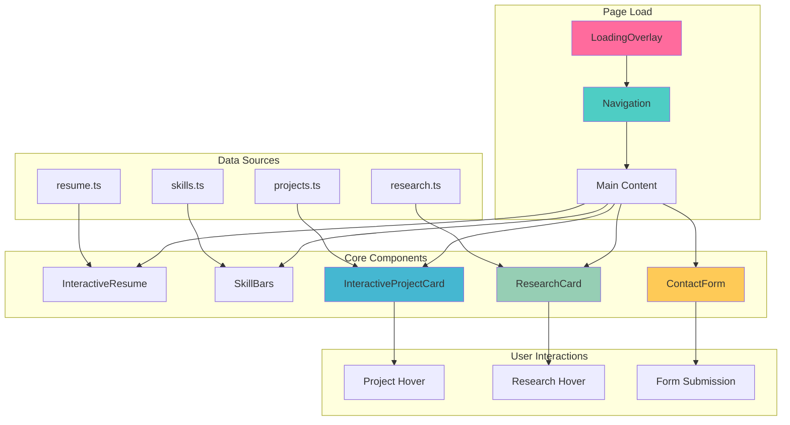
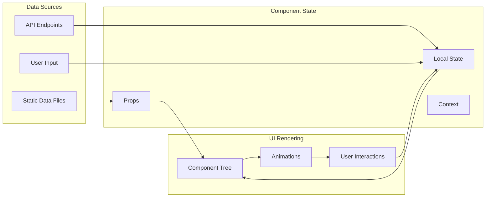
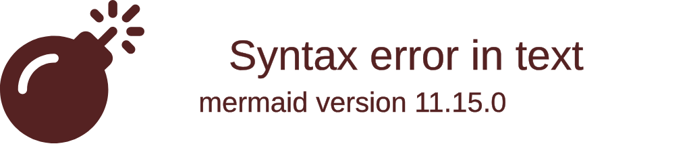

# 🎨 Klea Dev Components

> **A fabulous collection of React components for the most beautiful portfolio website** ✨

[](https://typescriptlang.org/)
[](https://reactjs.org/)
[](https://nextjs.org/)
[](https://tailwindcss.com/)
[](https://www.framer.com/motion/)

---

## 📋 Table of Contents

- [🚀 Quick Start](#-quick-start)
- [🏗️ Component Architecture](#️-component-architecture)
- [🎯 Component Overview](#-component-overview)
- [🔄 Data Flow](#-data-flow)
- [💻 Usage Examples](#-usage-examples)
- [🎨 Styling Guide](#-styling-guide)
- [🐛 Troubleshooting](#-troubleshooting)
- [🔮 Roadmap](#-roadmap)

---

## 🚀 Quick Start

### Installation
```bash
# Clone the repository
git clone <your-repo-url>
cd klea-dev

# Install dependencies
npm install

# Start development server
npm run dev
```

### Basic Usage
```tsx
import Navigation from '@/components/Navigation';
import InteractiveProjectCard from '@/components/InteractiveProjectCard';

const MyPage = () => {
  return (
    <div>
      <Navigation />
      <InteractiveProjectCard project={myProject} />
    </div>
  );
};
```

---

## 🏗️ Component Architecture



---

## 🎯 Component Overview

| Component | Size | Purpose | Complexity |
|-----------|------|---------|------------|
| 🧭 **Navigation** | 11KB | Main navigation with smooth scrolling | ⭐⭐⭐ |
| 🎨 **InteractiveProjectCard** | 12KB | Animated project showcase cards | ⭐⭐⭐⭐ |
| 📚 **ResearchCard** | 9.2KB | Interactive research paper display | ⭐⭐⭐ |
| 📝 **ContactForm** | 12KB | Form with validation & submission | ⭐⭐⭐⭐ |
| 💼 **InteractiveResume** | 11KB | Dynamic resume with animations | ⭐⭐⭐⭐ |
| 📊 **SkillBars** | 6.4KB | Animated skill visualization | ⭐⭐ |
| 🦶 **Footer** | 6.4KB | Site footer with social links | ⭐⭐ |
| ⏳ **LoadingOverlay** | 1.9KB | Client-side loading animation | ⭐ |

---

## 🔄 Data Flow



---

## 💻 Usage Examples

### 🧭 Navigation Component
```tsx
import Navigation from '@/components/Navigation';

// Self-contained navigation
<Navigation />
```

**Features:**
- ✅ Smooth scrolling to sections
- ✅ Active section highlighting
- ✅ Mobile-responsive hamburger menu
- ✅ Social media links integration

### 🎨 InteractiveProjectCard
```tsx
import InteractiveProjectCard from '@/components/InteractiveProjectCard';

const project = {
  title: "Amazing AI Project",
  description: "A fabulous machine learning project",
  image: "/screenshots/ai-project.jpg",
  platforms: ["github", "kaggle"],
  links: [
    { type: "github", url: "https://github.com/user/repo" },
    { type: "demo", url: "https://demo.com" }
  ]
};

<InteractiveProjectCard project={project} />
```

**Features:**
- ✅ Image overlay with project details
- ✅ Platform-specific styling
- ✅ Hover animations and transitions
- ✅ External link integration

### 📚 ResearchCard
```tsx
import ResearchCard from '@/components/ResearchCard';

const research = {
  title: "Advanced AI Systems",
  description: "Cutting-edge research in cognitive architecture",
  platform: "arxiv",
  links: [
    { type: "paper", url: "https://arxiv.org/abs/1234" },
    { type: "bibtex", url: "https://example.com/bibtex" }
  ],
  featured: true
};

<ResearchCard research={research} />
```

**Features:**
- ✅ Citation and BibTeX integration
- ✅ Platform-specific styling
- ✅ Download and external link support
- ✅ Featured research highlighting

### 📝 ContactForm
```tsx
import ContactForm from '@/components/ContactForm';

// Self-contained form with validation
<ContactForm />
```

**Features:**
- ✅ Real-time form validation
- ✅ Email integration via API routes
- ✅ Success/error state handling
- ✅ Responsive design

---

## 🎨 Styling Guide

### Color Palette
```css
/* Primary Colors */
--primary-gradient: linear-gradient(135deg, #ff6b9d, #c44569);
--secondary-color: #4ecdc4;
--accent-color: #45b7d1;

/* Text Colors */
--text-primary: #2d3436;
--text-secondary: #636e72;
--text-light: #b2bec3;

/* Platform Colors */
--github-color: #24292e;
--kaggle-color: #20beff;
--arxiv-color: #b31b1b;
```

### Animation Variants
```tsx
// Fade in up animation
const fadeInUp = {
  initial: { opacity: 0, y: 60 },
  animate: { opacity: 1, y: 0 },
  transition: { duration: 0.6, ease: "easeOut" }
};

// Stagger container
const staggerContainer = {
  initial: {},
  animate: {
    transition: {
      staggerChildren: 0.1,
      delayChildren: 0.3,
    },
  },
};
```

### Responsive Breakpoints
```css
/* Mobile First */
@media (min-width: 640px) { /* sm */ }
@media (min-width: 768px) { /* md */ }
@media (min-width: 1024px) { /* lg */ }
@media (min-width: 1280px) { /* xl */ }
```

---

## 🐛 Troubleshooting

### Common Issues

<details>
<summary>🚨 Hydration Errors</summary>

**Problem**: Server/client mismatch with loading states
```tsx
// ❌ Bad: Server-side loading state
const [isLoading, setIsLoading] = useState(true);

// ✅ Good: Client-side only
const [isLoading, setIsLoading] = useState(false);
useEffect(() => {
  setIsLoading(false);
}, []);
```

</details>

<details>
<summary>🎭 Animation Performance Issues</summary>

**Problem**: Janky animations on low-end devices
```tsx
// ❌ Bad: Animating layout properties
animate={{ width: 200, height: 200 }}

// ✅ Good: Use transform and opacity
animate={{ scale: 1.1, opacity: 0.8 }}
```

</details>

<details>
<summary>📱 Mobile Responsiveness</summary>

**Problem**: Components break on small screens
```tsx
// ✅ Good: Use responsive classes
<div className="grid grid-cols-1 md:grid-cols-2 lg:grid-cols-3">
  {items.map(item => (
    <Component key={item.id} item={item} />
  ))}
</div>
```

</details>

---

## 🔮 Roadmap

### 🎯 Planned Features
- [ ] Dark mode toggle
- [ ] Component storybook integration
- [ ] Advanced animation presets
- [ ] Internationalization support
- [ ] Component testing suite

### ⚡ Performance Improvements
- [ ] Component code splitting
- [ ] Image lazy loading optimization
- [ ] Animation performance monitoring
- [ ] Bundle size optimization

### 🎨 Design Enhancements
- [ ] Advanced hover effects
- [ ] Micro-interactions
- [ ] Custom cursor effects
- [ ] Parallax scrolling

---

## 📊 Component Statistics



---

## 🤝 Contributing

1. **Fork** the repository
2. **Create** a feature branch (`git checkout -b feature/amazing-component`)
3. **Commit** your changes (`git commit -m 'Add amazing component'`)
4. **Push** to the branch (`git push origin feature/amazing-component`)
5. **Open** a Pull Request

### Development Guidelines
- ✅ Use TypeScript for all components
- ✅ Follow the existing component patterns
- ✅ Add comprehensive documentation
- ✅ Include accessibility features
- ✅ Test on multiple devices

---

## 📄 License

This project is licensed under the MIT License - see the [LICENSE](LICENSE) file for details.

---

## 💖 Special Thanks

Built with love by the fabulous **Klea Dev** team! ✨

*"Code is poetry, and every component tells a story"* 💕

---

<div align="center">

**Made with ❤️ by [Klea Dev](https://github.com/klea-dev)**

[](https://github.com/klea-dev/portfolio)
[](https://github.com/klea-dev/portfolio)
[](https://github.com/klea-dev/portfolio/issues)

</div> 