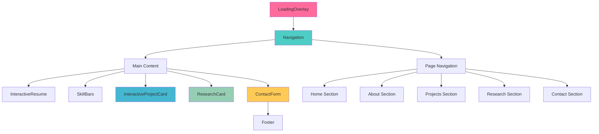

# 🎨 Component Architecture Documentation

## Overview
This document provides a comprehensive guide to the component architecture of the Klea Dev portfolio website. Each component is designed with modularity, reusability, and beautiful user experience in mind.

## 📁 Component Directory Structure
```
app/components/
├── Navigation.tsx          # Main navigation bar with smooth scrolling
├── ResearchCard.tsx        # Interactive research paper display cards
├── InteractiveProjectCard.tsx  # Animated project showcase cards
├── Footer.tsx             # Site footer with social links
├── LoadingOverlay.tsx     # Client-side loading animation
├── SkillBars.tsx          # Animated skill visualization
├── ContactForm.tsx        # Interactive contact form with validation
└── InteractiveResume.tsx  # Dynamic resume component
```

## 🔄 Component Flow Diagram



## 🎯 Component Details

### Navigation.tsx
**Purpose**: Main navigation bar with smooth scrolling and responsive design
**Key Features**:
- Smooth scroll to sections
- Active section highlighting
- Mobile-responsive hamburger menu
- Social media links integration

**Props**: None (uses internal state)
**Dependencies**: Framer Motion, Lucide React icons

### InteractiveProjectCard.tsx
**Purpose**: Animated project showcase cards with hover effects
**Key Features**:
- Image overlay with project details
- Platform-specific styling (GitHub, Kaggle, etc.)
- Hover animations and transitions
- External link integration

**Props**:
```typescript
interface ProjectCardProps {
  project: {
    title: string;
    description: string;
    image?: string;
    platforms: Platform[];
    links: ProjectLink[];
  };
}
```

### ResearchCard.tsx
**Purpose**: Interactive research paper and notebook display
**Key Features**:
- Citation and BibTeX integration
- Platform-specific styling
- Download and external link support
- Featured research highlighting

**Props**:
```typescript
interface ResearchCardProps {
  research: {
    title: string;
    description: string;
    platform: Platform;
    links: ResearchLink[];
    featured?: boolean;
  };
}
```

### ContactForm.tsx
**Purpose**: Interactive contact form with validation and submission
**Key Features**:
- Real-time form validation
- Email integration via API routes
- Success/error state handling
- Responsive design

**Props**: None (uses internal state and API calls)

### InteractiveResume.tsx
**Purpose**: Dynamic resume component with animated sections
**Key Features**:
- Expandable experience sections
- Skill visualization
- Timeline-based layout
- Smooth animations

**Props**: None (uses static data)

### SkillBars.tsx
**Purpose**: Animated skill visualization with progress bars
**Key Features**:
- Animated progress bars
- Skill categorization
- Hover effects
- Responsive layout

**Props**:
```typescript
interface SkillBarsProps {
  skills: Skill[];
  category?: string;
}
```

### LoadingOverlay.tsx
**Purpose**: Client-side loading animation for smooth UX
**Key Features**:
- Framer Motion animations
- Fade-in/out transitions
- Prevents hydration issues
- Minimal performance impact

**Props**: None (uses internal state)

### Footer.tsx
**Purpose**: Site footer with social links and branding
**Key Features**:
- Social media integration
- Copyright information
- Responsive design
- Smooth animations

**Props**: None (uses static data)

## 🎨 Design System

### Color Palette
- **Primary**: Custom gradient (pink to purple)
- **Secondary**: Slate grays for text
- **Accent**: Platform-specific colors (GitHub black, Kaggle blue, etc.)

### Typography
- **Headings**: Responsive font sizes with gradient text
- **Body**: Clean, readable sans-serif
- **Code**: Monospace for technical content

### Animations
- **Framer Motion**: All animations use Framer Motion for consistency
- **Stagger Effects**: Sequential animations for lists
- **Hover States**: Subtle scale and color transitions

## 🔧 Technical Implementation

### State Management
- **Local State**: Each component manages its own state
- **No Global State**: Keeps components modular and independent
- **Props Drilling**: Minimal, only when necessary

### Performance Optimizations
- **Image Optimization**: Next.js Image component for all images
- **Lazy Loading**: Components load as needed
- **Animation Optimization**: Hardware-accelerated animations

### Accessibility
- **ARIA Labels**: Proper accessibility attributes
- **Keyboard Navigation**: Full keyboard support
- **Screen Reader**: Semantic HTML structure
- **Color Contrast**: WCAG compliant color ratios

## 🚀 Usage Examples

### Basic Component Usage
```tsx
import InteractiveProjectCard from '@/components/InteractiveProjectCard';

const MyComponent = () => {
  const project = {
    title: "My Amazing Project",
    description: "A fabulous project description",
    platforms: ["github", "kaggle"],
    links: [
      { type: "github", url: "https://github.com/user/repo" }
    ]
  };

  return <InteractiveProjectCard project={project} />;
};
```

### Custom Styling
```tsx
import { motion } from 'framer-motion';

const CustomCard = () => {
  return (
    <motion.div
      initial={{ opacity: 0, y: 20 }}
      animate={{ opacity: 1, y: 0 }}
      transition={{ duration: 0.6 }}
      className="custom-card"
    >
      {/* Your content */}
    </motion.div>
  );
};
```

## 🐛 Common Issues & Solutions

### Hydration Errors
**Problem**: Server/client mismatch with loading states
**Solution**: Use LoadingOverlay component for client-side only rendering

### Animation Performance
**Problem**: Janky animations on low-end devices
**Solution**: Use `transform` and `opacity` properties only

### Mobile Responsiveness
**Problem**: Components break on small screens
**Solution**: Use responsive design classes and test on multiple devices

## 📈 Future Enhancements

### Planned Features
- [ ] Dark mode toggle
- [ ] Component storybook integration
- [ ] Advanced animation presets
- [ ] Internationalization support
- [ ] Component testing suite

### Performance Improvements
- [ ] Component code splitting
- [ ] Image lazy loading optimization
- [ ] Animation performance monitoring
- [ ] Bundle size optimization

---

*This documentation is maintained by the fabulous Klea Dev team* 💖✨ 