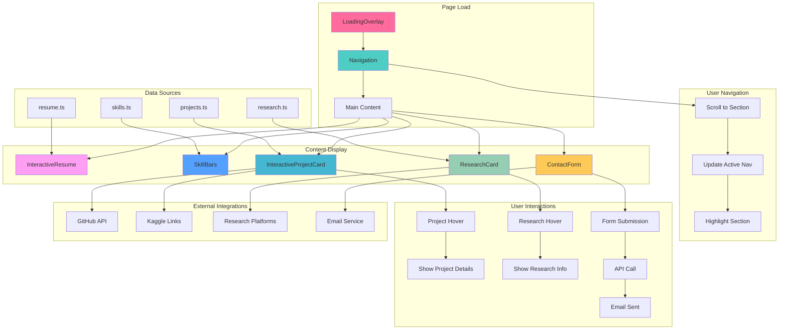
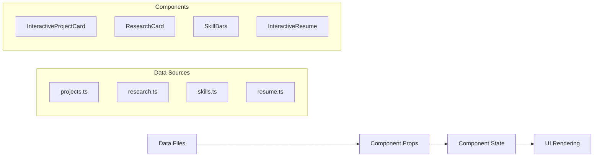
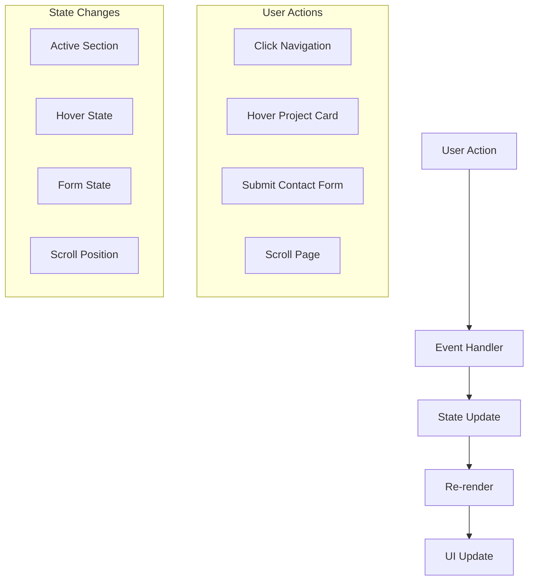

# 🔄 Component Interactions & Data Flow

## 🎯 Overview
This document illustrates how all components in the Klea Dev portfolio interact with each other, including data flow, state management, and user interactions.

## 📊 Component Interaction Diagram



## 🔄 Data Flow Architecture

### 1. Static Data Flow


### 2. User Interaction Flow


## 🎯 Component Dependencies

### Navigation Dependencies
```typescript
// Navigation.tsx dependencies
import { motion } from 'framer-motion';
import { Github, Linkedin, Mail } from 'lucide-react';
import { usePathname } from 'next/navigation';
```

### Project Card Dependencies
```typescript
// InteractiveProjectCard.tsx dependencies
import { motion } from 'framer-motion';
import { ExternalLink, Github, Database, Cpu, Globe } from 'lucide-react';
import Image from 'next/image';
import { platformConfig } from '@/data/platformConfig';
```

### Research Card Dependencies
```typescript
// ResearchCard.tsx dependencies
import { motion } from 'framer-motion';
import { ExternalLink, Download, BookOpen, FileText } from 'lucide-react';
import { platformConfig } from '@/data/platformConfig';
```

## 🔄 State Management Patterns

### 1. Local Component State
```typescript
// Example: InteractiveProjectCard
const [isHovered, setIsHovered] = useState(false);
const [isExpanded, setIsExpanded] = useState(false);
```

### 2. Shared State (Minimal)
```typescript
// Navigation active section
const [activeSection, setActiveSection] = useState('home');
```

### 3. Form State Management
```typescript
// ContactForm state
const [formData, setFormData] = useState({
  name: '',
  email: '',
  message: ''
});
const [isSubmitting, setIsSubmitting] = useState(false);
```

## 🎨 Animation Coordination

### Stagger Animations
```typescript
// Coordinated animations across components
const staggerContainer = {
  initial: {},
  animate: {
    transition: {
      staggerChildren: 0.1,
      delayChildren: 0.3,
    },
  },
};
```

### Hover State Coordination
```typescript
// Project card hover effects
const cardVariants = {
  initial: { scale: 1 },
  hover: { 
    scale: 1.05,
    transition: { duration: 0.2 }
  },
};
```

## 🔧 Performance Optimizations

### 1. Lazy Loading
```typescript
// Components load as needed
const ContactForm = dynamic(() => import('./ContactForm'), {
  loading: () => <div>Loading...</div>
});
```

### 2. Image Optimization
```typescript
// Next.js Image component for all images
<Image
  src={project.image}
  alt={project.title}
  width={400}
  height={300}
  className="object-cover"
/>
```

### 3. Animation Performance
```typescript
// Hardware-accelerated animations
const motionProps = {
  initial: { opacity: 0, y: 20 },
  animate: { opacity: 1, y: 0 },
  transition: { 
    duration: 0.6,
    ease: "easeOut"
  },
};
```

## 🐛 Common Interaction Issues

### Issue: Components not animating together
**Cause**: Missing stagger coordination
**Solution**: Use shared animation variants

### Issue: Form submission blocking UI
**Cause**: Synchronous API calls
**Solution**: Use async/await with loading states

### Issue: Navigation highlighting lag
**Cause**: Scroll event throttling
**Solution**: Use Intersection Observer API

## 🎯 Best Practices

### 1. Component Communication
- Use props for parent-child communication
- Keep state local when possible
- Use context only when necessary

### 2. Performance
- Memoize expensive calculations
- Use React.memo for pure components
- Optimize re-renders with useCallback

### 3. Accessibility
- Maintain focus management
- Provide keyboard navigation
- Use semantic HTML

## 🔮 Future Enhancements

### Planned Interactions
- [ ] Drag and drop project reordering
- [ ] Advanced filtering and search
- [ ] Real-time collaboration features
- [ ] Interactive skill assessments
- [ ] Dynamic content loading

### Performance Improvements
- [ ] Virtual scrolling for large lists
- [ ] Advanced caching strategies
- [ ] Progressive web app features
- [ ] Offline functionality

---

*This interaction guide is part of the fabulous Klea Dev documentation suite* 💖✨ 