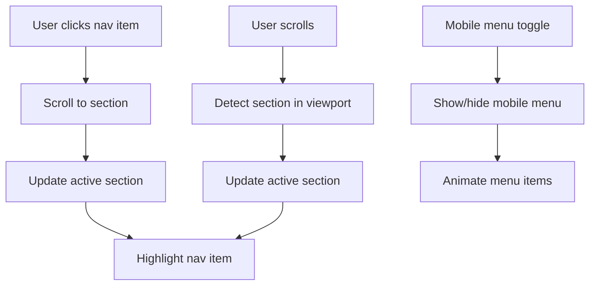

# 🧭 Navigation Component

## Overview
The Navigation component is the main navigation bar that provides smooth scrolling between sections and responsive mobile navigation. It's designed to be elegant, accessible, and performant.

## 🎯 Purpose
- Provide smooth navigation between page sections
- Display active section highlighting
- Handle mobile-responsive hamburger menu
- Integrate social media links
- Maintain consistent branding

## 📋 Props Interface
```typescript
// No props - uses internal state and context
interface NavigationProps {
  // This component is self-contained
}
```

## 🔧 Implementation Details

### Key Features
1. **Smooth Scrolling**: Uses `scrollIntoView` with smooth behavior
2. **Active Section Detection**: Tracks current section in viewport
3. **Mobile Responsive**: Hamburger menu for small screens
4. **Social Links**: Integrated social media icons
5. **Accessibility**: Full keyboard navigation support

### State Management
```typescript
const [isMenuOpen, setIsMenuOpen] = useState(false);
const [activeSection, setActiveSection] = useState('home');
```

### Navigation Items
```typescript
const navItems = [
  { name: "Home", href: pathname === "/" ? "home" : "/" },
  { name: "About", href: "about" },
  { name: "Projects", href: "/projects" },
  { name: "Research", href: "/research" },
  { name: "Contact", href: "contact" },
];
```

## 🎨 Styling

### CSS Classes
- `.nav-container`: Main navigation wrapper
- `.nav-item`: Individual navigation links
- `.nav-item.active`: Active section styling
- `.mobile-menu`: Mobile hamburger menu
- `.social-links`: Social media icons container

### Responsive Design
```css
/* Desktop */
.nav-container {
  position: fixed;
  top: 0;
  width: 100%;
  z-index: 1000;
}

/* Mobile */
@media (max-width: 768px) {
  .mobile-menu {
    display: block;
  }
  
  .nav-items {
    display: none;
  }
}
```

## 🚀 Usage Example

### Basic Implementation
```tsx
import Navigation from '@/components/Navigation';

const Layout = () => {
  return (
    <div>
      <Navigation />
      <main>
        {/* Your page content */}
      </main>
    </div>
  );
};
```

### Custom Styling
```tsx
// The component is self-contained, but you can wrap it
<div className="custom-nav-wrapper">
  <Navigation />
</div>
```

## 🔄 Component Flow



## 🐛 Common Issues

### Issue: Navigation not highlighting correctly
**Cause**: Section IDs don't match navigation hrefs
**Solution**: Ensure section IDs match exactly:
```html
<section id="about">  <!-- Must match nav href -->
  <h2>About</h2>
</section>
```

### Issue: Mobile menu not working
**Cause**: Missing state management
**Solution**: Check `isMenuOpen` state and toggle function

### Issue: Smooth scroll not working
**Cause**: Browser compatibility
**Solution**: Add polyfill or fallback:
```typescript
const scrollToSection = (sectionId: string) => {
  const element = document.getElementById(sectionId);
  if (element) {
    element.scrollIntoView({ 
      behavior: 'smooth',
      block: 'start'
    });
  }
};
```

## 🎯 Performance Optimizations

1. **Throttled Scroll Events**: Prevents excessive re-renders
2. **Intersection Observer**: Efficient section detection
3. **CSS Transforms**: Hardware-accelerated animations
4. **Minimal Re-renders**: Only update when necessary

## ♿ Accessibility Features

- **Keyboard Navigation**: Full tab support
- **ARIA Labels**: Proper accessibility attributes
- **Focus Management**: Clear focus indicators
- **Screen Reader**: Semantic HTML structure

## 🔮 Future Enhancements

- [ ] Dark mode support
- [ ] Breadcrumb navigation
- [ ] Search functionality
- [ ] Multi-language support
- [ ] Advanced animations

---

*Part of the fabulous Klea Dev component library* 💖✨ 